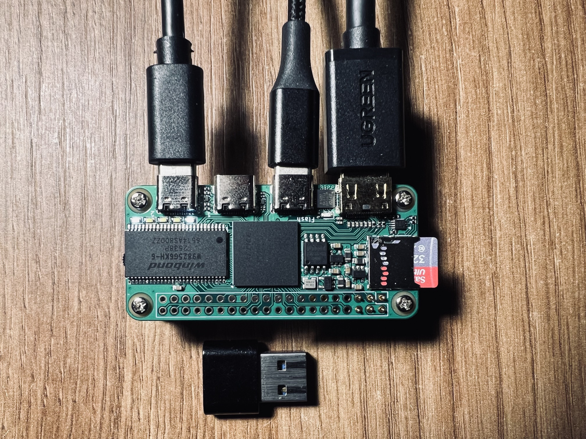

# icepi-zero-c64

A complete C64 implementation for the IcePi-Zero FPGA board, featuring HDMI video output, dual USB HID input support, and 1541 floppy drive emulation.

This project integrates several open-source FPGA cores to reproduce functionality of the original C64 hardware:

- 6510 CPU - https://github.com/GideonZ/1541ultimate/tree/master/fpga/6502n/vhdl_source (Gideon Zweijtzer)
- VIC-II graphics chip - https://github.com/randyrossi/vicii-kawari (Randy Rossi)
- SID 6581 / 8580 sound chip - https://github.com/daglem/reDIP-SID (Dag Lem)
- CIA 6526 / 8521 I/O chips - https://github.com/daglem/reDIP-CIA (Dag Lem)
- 1541 floppy drive - based on the C1541 implementation from the [MiSTer C64 core](https://github.com/MiSTer-devel/C64_MiSTer); greatly reworked for this project but still uses that implementation as its base

In addition, the system runs a LiteX SoC with a VexRiscv soft-core CPU to handle system services such as SD card access and ROM loading - https://github.com/enjoy-digital/litex

Many thanks to all of the above authors and the MiSTer community — this project would not exist without their work.

Hardware used - [IcePi-Zero](https://github.com/cheyao/icepi-zero) FPGA board (Lattice ECP5U-25F with 256Mbit SDRAM)

### Why this project?

- **100% open-source toolchain.** Every step of the build — synthesis (Yosys), place-and-route (nextpnr), bitstream packing (Project Trellis), SoC generation (LiteX), CPU core (VexRiscv), and firmware (GCC) — is free and open-source. No vendor IDE, no closed IP cores, no license server. You can rebuild the whole system end-to-end from source on a Linux laptop.
- **Tiny and portable.** The IcePi-Zero is roughly Raspberry-Pi-Zero-sized and the whole C64 — CPU, VIC-II, two SIDs, two CIAs, a 1541 drive, HDMI output, dual USB HID, and the LiteX/VexRiscv SoC — fits into a single Lattice ECP5U-25F. To the best of the author's knowledge this is the smallest and most portable complete FPGA C64 design currently available.
- **Battery-friendly.** The board draws around **200 mA** at 5 V during typical emulation, so it runs happily off a small USB power bank or the matching UPS HAT — turning it into a fully portable C64 you can take anywhere.

[Watch popular C64 demos](https://youtube.com/playlist?list=PLx57TRDm5jOb3XmBs3nD0p_45FGw70Ht1&si=9r16wObv-iXTmFdy) recorded via HDMI grabber connected directly to the board!



## Building

### Prerequisites

Install the following tools:
- GHDL
- Yosys
- Project Trellis
- nextpnr (with ECP5 support)
- Python 3.8+
- openFPGALoader

### Setup Build Environment

```bash
# Clone repository with submodules
git clone --recursive https://github.com/m1nl/icepi-zero-c64
cd icepi-zero-c64

# Initialize git submodules
git submodule update --init

# Create Python virtual environment
python3 -m venv venv
source venv/bin/activate

# Install LiteX
mkdir litex_src
cd litex_src
wget https://raw.githubusercontent.com/enjoy-digital/litex/master/litex_setup.py
chmod +x litex_setup.py
./litex_setup.py --init --install
cd ..
```

### Build Gateware and Firmware

```bash
# Build FPGA bitstream
python3 -m boards.targets.icepi_zero --build

# Build firmware
make -C firmware BUILD_DIR=../build/icepi_zero/
```

## Installation

### Flash FPGA

```bash
# Flash bitstream to SPI flash
openFPGALoader -b icepi-zero --write-flash build/icepi_zero/gateware/icepi_zero.bit

# Flash BIOS to SPI flash at offset 0x200000
openFPGALoader -b icepi-zero --write-flash --offset 0x200000 build/icepi_zero/software/bios/bios.bin
```

### Download ROMs
```bash
# Change to c64_roms directory
cd c64_roms

# Download ROMs
./get_stock.sh
```

### Prepare SD Card

1. Format SD card as FAT32
2. Copy `firmware/boot.json` to SD card root
3. Copy `firmware/icepi-zero-c64.bin` to SD card root
4. Create a `c64_roms` directory on the SD card
5. Copy contents of `c64_roms/dist/*` to `c64_roms` on the SD card

## Usage

### Special keys

The following host-keyboard keys are intercepted by the gateware (see `gateware/c64_keyboard.v`) and never reach the emulated C64 keyboard matrix:

| Host key          | Action                                                                  |
| ----------------- | ----------------------------------------------------------------------- |
| `Print Screen`    | Toggle the on-screen firmware overlay                                   |
| `Pause` / `Break` | Reset the C64 CPU                                                       |
| `F12`             | Trigger cartridge freeze (e.g. Action Replay)                           |
| `Escape`          | Run/Stop + Restore (NMI, via USB HID); also Run/Stop on PS/2            |
| `Tab`             | Restore (NMI) on USB HID                                                |
| `Shift` + `-`     | Tape play pulse                                                         |

The firmware console also reacts to a few `Alt`+key shortcuts, which toggle and persist runtime flags:

| Shortcut | Flag toggled                                  |
| -------- | --------------------------------------------- |
| `Alt+j`  | Joystick port invert (swap port 1 and port 2) |
| `Alt+k`  | Joystick emulation on keyboard (port A)       |
| `Alt+s`  | SID model (6581 / 8580)                       |
| `Alt+c`  | CIA model (6526 / 8521)                       |
| `Alt+d`  | Dual SID mode                                 |

### Gamepad buttons

When a USB gamepad is connected, the following button combinations are recognised directly by the gateware:

| Combination                | Action         |
| -------------------------- | -------------- |
| `Select`, or `X` + `Y`     | Toggle overlay |
| `Select` + `Start`, or `A` + `B` + `X` + `Y` | Reset C64 |

Holding the `Y` button switches the gamepad into keyboard-control mode: the D-pad generates cursor-key presses, `A` = Return, `B` = Space, `Select` = F3, `Start` = F1.

### Firmware console

The LiteX/VexRiscv SoC exposes a serial console (`icepi-c64>` prompt). The `help` command lists every built-in command; they are documented below.

| Command                   | Description                                                                 |
| ------------------------- | --------------------------------------------------------------------------- |
| `help`                    | Print the list of available commands.                                       |
| `reboot`                  | Reboot the VexRiscv SoC (firmware restart, not C64 reset).                  |
| `sdcard_reset`            | Re-initialise the SPI SD card controller — use if the card was swapped.     |
| `ls [path]`               | List the contents of an SD card directory (root if no path is given).       |
| `hexdump <addr> [len]`    | Hex dump `len` bytes (default 256) starting at the given memory address.    |
| `console`                 | Redirect the serial console to the C64 (use `Ctrl+C` to break out).         |
| `mount <path> [0\|1]`     | Mount a `.d64` disk image for the emulated 1541 (`1` = read-write).         |
| `umount`                  | Unmount the currently mounted `.d64` image.                                 |
| `format <path> <label>`   | Create and format a new `.d64` disk image with the given volume label.      |
| `sync`                    | Commit any pending writes on a read-write mounted `.d64` back to SD card.   |
| `tape_load <path>`        | Attach a `.tap` tape image to the emulated Datasette.                       |
| `tape_eject`              | Detach the current `.tap` image.                                            |
| `flags`                   | Show every runtime flag, its bit number, current value and description.     |
| `flag <name> [0\|1]`      | Set (`1`), clear (`0`), or toggle (no argument) a flag; state is persisted. |
| `reset`                   | Reset the emulated C64 CPU (clears RAM to the cartridge-dependent pattern). |
| `pause`                   | Halt the C64 CPU clock.                                                     |
| `resume`                  | Resume the C64 CPU clock after `pause`.                                     |
| `power`                   | Report voltage, current and power readings from the INA219 on the UPS HAT.  |

Flag values are auto-saved to a JSON file on the SD card, so any toggle (through `flag`, the `Alt`+key shortcuts, or the overlay) survives a power cycle.

### Runtime flags

The `flag <name> [0|1]` command (and the persisted JSON file) operate on the following configuration bits, defined in `firmware/main.h`:

| Flag                    | Purpose                                                                                                       |
| ----------------------- | ------------------------------------------------------------------------------------------------------------- |
| `cia_model`             | Selects the CIA variant used for both CIA1 and CIA2 (`0` = 6526, `1` = 8521).                                 |
| `sid_model`             | Selects the SID variant (`0` = 6581, `1` = 8580) — changes filter characteristics and the "dead" waveform.    |
| `sid_dual`              | Enables dual-SID output: the second SID is mapped at `$D420` for stereo music playback.                       |
| `sid_pan`               | Applies panning correction when dual-SID is active (fixes very wide stereo image with dual-SID playback).     |
| `sid_auto_mono`         | When the second SID is idle, output is automatically summed to mono — avoids silent channel on mono software. |
| `va_delay`              | Emulates the VA14/VA15 glitch delay of the original `U14` 74LS257 — required by some demos/effects.           |
| `overlay`               | Enables the on-screen terminal overlay (toggled by `Print Screen` or the overlay interrupt).                  |
| `joy_invert`            | Swaps joystick ports 1 and 2 (useful when a game expects the opposite port to the one you plugged into).      |
| `joy_button_space`      | Maps the gamepad's second fire button to the `Space` key (useful for games using Space as a secondary fire).  |
| `joy_emulation_0`       | Allows using the host keyboard as joystick port 1 (cursor keys + `F`/`Space` for fire).                       |
| `joy_emulation_1`       | Same as above, but for joystick port 2.                                                                       |
| `cart_present`          | Indicates that a cartridge is present; ignored if `/c64_roms/ar6_pal.bin` is not present upon reboot          |
| `iec_master_disconnect` | Disconnects the C64 from the virtual IEC bus.                                                                 |

## Architecture notes

### 1541 disk sectors via shared BRAM

The emulated 1541 does not read its disk sectors from SDRAM directly; instead it exchanges fixed-size sector buffers with the VexRiscv firmware through a dedicated on-chip BRAM mapped on Wishbone bus.

**Gateware** (`boards/targets/icepi_zero.py`, `drive_shmem` block; `gateware/c64_top.v`):

- `drive_shmem` is an 8 KB `wishbone.SRAM` (true dual-port BRAM) added as a Wishbone slave at `mem_map["drive_shmem"] = 0x50000000`.
  - One port faces Wishbone — the CPU sees the buffer as 8 KB of memory at `0x50000000`.
  - The second port is obtained with `mem.get_port(has_re=False, write_capable=True, we_granularity=8, mode=WRITE_FIRST)` and wired into `C64Top` as `drive_shmem_port`, giving the gateware byte-granular access to the same cells without going through bus arbitration.
- The `c64_c1541` core exposes sector interface:
  - Control: `block_lba[31:0]`, `block_cnt[5:0]`, `block_rd`, `block_wr`, `block_ack` — promoted to `c64_control` CSRs and raised as IRQs (`EV_BLOCK_RD` / `EV_BLOCK_WR`).
  - Buffer: `buff_addr[12:0]`, `buff_din[7:0]`, `buff_dout[7:0]`, `buff_we`, `buff_en` — the 8-bit sector bus.
- Width adaptation in `c64_top.v`: `drive_shmem_addr = buff_addr[12:2]`, `drive_shmem_din = {buff_din,buff_din,buff_din,buff_din}` (replicated across all four byte lanes). `buff_addr[1:0]` selects the active byte lane for writes (`drive_shmem_we[x]`) and for the `drive_shmem_dout[…]` read mux. The per-byte `we_granularity=8` ensures only the addressed byte is written.

**Firmware** (`firmware/c64_disk.c`):

- The full `.d64` image is loaded into SDRAM (`d64_data`, malloc'd) with FatFS at mount time.
- Linker symbols `_fdrive_shmem` / `_edrive_shmem` bracket the CPU-visible window of the 8 KB BRAM, so `buf_size = &_edrive_shmem - &_fdrive_shmem`.
- The `c64_disk_isr()` handler runs on each block request:
  - Reads `c64_control_block_lba` / `c64_control_block_cnt`.
  - `EV_BLOCK_RD` → `serve_lba()` does `memcpy(&_fdrive_shmem, d64_data + lba*256, cnt*256)`, clamped to the BRAM window and the image size (zero-filled if out of range), then calls `flush_cpu_dcache()` + `flush_l2_cache()` so the cached writes land in the physical BRAM the drive port reads from.
  - `EV_BLOCK_WR` → `store_lba()` copies in the opposite direction, marks `d64_dirty`, and schedules a commit.
  - In both cases the ISR toggles `c64_control_block_ack`, which the drive waits on before advancing to the next GCR sector.
- `c64_disk_service()` flushes a dirty image back to SD card 5 seconds after the last write and CRC32-validates it against the in-memory copy.

Tracks are therefore not streamed byte-by-byte: the 1541 core asks for an LBA, the CPU fills the shared BRAM, and the drive FSM reads the sector out of BRAM at its own pace through the second port.

### TAP playback via Wishbone DMA

Tape replay is a true bus-master DMA — once armed, the gateware pulls TAP bytes from SDRAM at pulse rate with zero CPU involvement.

**Gateware** (`boards/targets/icepi_zero.py`, `Tape player DMA` block; `gateware/c64_tape.v`):

- A read-only Wishbone master is added to the system bus:
  ```python
  tap_dma_bus = wishbone.Interface(..., mode="r")
  self.bus.add_master(master=tap_dma_bus, name="tap_dma")
  self.tap_dma = WishboneDMAReader(bus=tap_dma_bus, with_csr=True)
  ```
  `with_csr=True` autogenerates the CSRs used by the firmware: `tap_dma_base`, `tap_dma_length`, `tap_dma_enable`, `tap_dma_loop`.
- The DMA reader produces a 32-bit stream. A three-stage pipeline turns it into the 8-bit byte stream the tape emulator consumes:
  ```python
  tap_converter = stream.Converter(bus.data_width, 8, reverse=True)
  tap_fifo      = stream.SyncFIFO([("data", 8)], 32, buffered=True)
  tap_dma.source     -> tap_converter.sink
  tap_converter.source -> tap_fifo.sink
  tap_fifo.source    -> c64_top.tap_sink
  ```
  `reverse=True` unpacks each 32-bit word MSB-first to match TAP byte order. The FIFO decouples bus latency from the tape FSM.
- Inside `c64_top.v`, `tap_sink` drives `c64_tape` via `tap_fifo_rd_data` / `tap_fifo_rd_valid` / `tap_fifo_rd_en`. The tape core back-pressures the pipeline by raising `tap_fifo_rd_en` only when it needs another pulse-length byte — this stalls the DMA on Wishbone, so SDRAM is read exactly as fast as the ~1 MHz tape pulses consume it.
- `c64_tape.v` is a small FSM (`DRAIN → IDLE → HEADER → MOTOR → PLAY`) that consumes the 12-byte `C64-TAPE-RAW` signature and version, then converts each TAP byte (or 24-bit run for TAP v1/v2) into a wave length driving `cass_read` (wired to CIA1 `flag_n`). `cass_sense_n` reports tape presence to the C64.

**Firmware** (`firmware/c64_tape.c`):

- `c64_tape_load()` allocates `size + 32` bytes in SDRAM, reads the `.tap` file into it, pads the trailing 32 bytes with `0x2a` (extra delay after the last real pulse), and calls `flush_cpu_dcache()` + `flush_l2_cache()` — mandatory because the DMA master bypasses the CPU cache.
- `c64_tape_start()` arms the DMA and kicks the FSM:
  ```c
  tap_dma_enable_write(0);                     // disarm
  tap_dma_base_write((uintptr_t)tap_data);
  tap_dma_length_write(tap_size);
  tap_dma_loop_write(0);                       // one-shot
  tap_dma_enable_write(1);                     // go
  // …then toggle tape_play to move the FSM out of IDLE
  c64_control_tape_play_write(~c64_control_tape_play_read());
  ```
- `c64_tape_stop()` disables the DMA, waits for pipeline drain, and toggles `tape_play` again to return to IDLE.
- Play/stop are triggered by the emulated deck: the gateware raises `EV_TAPE_PLAY` / `EV_TAPE_STOP` when the C64 asks for it (or when `Shift+-` is pressed). The ISR just records a `tap_play_running_next` request; the actual DMA arming happens in `c64_tape_service()` from the main loop, keeping the IRQ short.

Once armed, the DMA streams continuously from SDRAM; the Converter+FIFO deliver bytes; the tape FSM pulls them at pulse rate and back-pressures the whole chain through `tap_fifo_rd_en`, so pulse timing is dictated by the gateware and not by CPU response latency.
